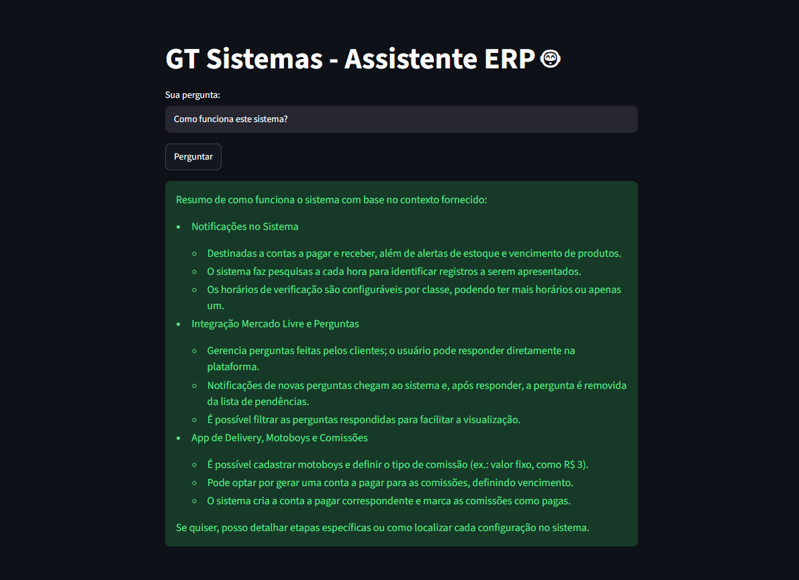
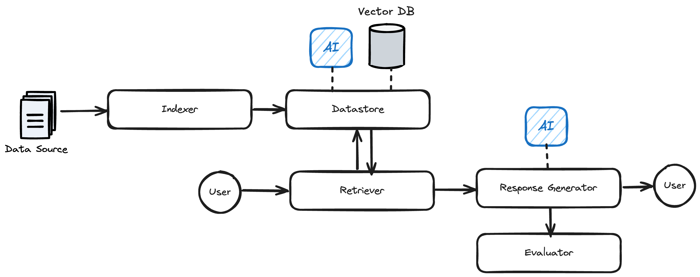

# 🧠 GT Sistemas — Assistente ERP (RAG Pipeline)

Sistema de **Retrieval Augmented Generation (RAG)** que responde perguntas sobre a base de conhecimento do ERP **GT Sistemas** com respostas precisas, rápidas e citando o contexto real da documentação — não "achismo" de LLM solto.

Interface web em **Streamlit**, armazenamento vetorial em **LanceDB**, reranking via **OpenAI GPT-4o-mini** e geração de resposta via **OpenAI GPT-5-nano**. Deploy automático no Streamlit Cloud.



---

## 🚀 Por que este projeto se destaca

Não é só "mais um wrapper de ChatGPT". É um pipeline de RAG **versionado, medido e otimizado com dados reais de performance** — a maioria dos projetos RAG por aí não tem isso.

### v1.0 → v2.0: otimização orientada a métricas

| Métrica | v1.0 | v2.0 | Resultado |
|---|---|---|---|
| **Acurácia** | 96% (24/25) | 88% (22/25) | -8% |
| **Latência média** | 15,8s | **5,2s** | **67% mais rápido** |
| **Latência máxima** | 25s | 10,6s | **58% mais rápido** |
| **Custo em tokens** | 100% | **33%** | **67% de economia** |
| **Estabilidade (desvio padrão)** | 4,47s | 2,46s | **45% mais estável** |

> **Trade-off consciente:** trocamos 8 pontos de acurácia por um sistema 67% mais rápido e 67% mais barato — decisão validada com [evaluator automatizado](./src/impl/evaluator.py), não no "achismo". Para um assistente de suporte usado o dia inteiro por operadores do ERP, resposta em ~5s vale muito mais do que os 96% -> 88%.

### Método: como a otimização foi feita

Os números acima não vieram de um único ajuste, mas de um processo iterativo de tuning em três alavancas do pipeline, sempre medido com o mesmo gabarito fixo ([sample_data/eval/sample_questions.json](./sample_data/eval/sample_questions.json)) rodando `python main.py evaluate`:

1. **Modelo de rerank e geração** — testar modelos mais leves (ex.: `gpt-4o-mini` para o [rerank](./src/impl/retriever.py), `gpt-5-nano` para a [geração de resposta](./src/util/invoke_ai.py)) em vez de modelos maiores, trocando velocidade/custo por uma possível perda de nuance na resposta.
2. **Quantidade de chunks levados ao rerank (`top_k`)** — reduzir quantos candidatos o `Datastore.search()` retorna antes do LLM reordenar (hoje `top_k=5` em [retriever.py:24](./src/impl/retriever.py#L24)) diminui tokens processados e latência, mas aumenta o risco do chunk certo nem entrar na lista de candidatos.
3. **Iteração comparativa** — a cada mudança nas alavancas 1 e 2, rodar `python main.py evaluate -f sample_data/eval/sample_questions.json` de novo e comparar acurácia/latência/custo contra a rodada anterior, até achar o ponto de equilíbrio que virou a v2.0.

O [Evaluator](./src/impl/evaluator.py) é o que torna esse processo objetivo: ele usa um segundo LLM como "juiz", comparando cada resposta gerada com a resposta esperada do gabarito (sem exigir correspondência literal, só correção factual) e devolve `true`/`false` com o raciocínio — é dessa forma que "achei que ficou pior" virou "88% de acurácia, 22/25".

> **Nota de transparência:** as variantes intermediárias testadas durante essa iteração (combinações específicas de modelo/`top_k` que não viraram a versão final) não foram versionadas no Git — só o resultado final de cada versão (v1.0 e v2.0) foi commitado. O [CHANGELOG.md](./CHANGELOG.md) registra o resultado; este README registra o método.

---

## ⚙️ Como funciona

```
Data Source → Indexer → Datastore (LanceDB + embeddings)
                              ↓
        User → Retriever ⇄ Datastore → Response Generator (OpenAI) → User
                                              ↓
                                          Evaluator
```



- **Indexer** — quebra a base de conhecimento do GT Sistemas em chunks indexáveis, usando os títulos markdown (`#`/`##`/`###`) como hierarquia de contexto.
- **Datastore** — persiste embeddings em **LanceDB** e resolve busca por similaridade.
- **Retriever** — busca os candidatos mais próximos no Datastore e aplica **reranking via LLM (GPT-4o-mini)** para reordenar por relevância real à pergunta.
- **Response Generator** — chama a **OpenAI (GPT-5-nano)** ([src/util/invoke_ai.py](./src/util/invoke_ai.py)) para gerar uma resposta objetiva com base apenas no contexto recuperado.
- **Evaluator** — compara respostas geradas com um gabarito de perguntas/respostas esperadas e explica o veredito — é assim que os números da tabela acima foram medidos.

Toda a arquitetura segue **interfaces abstratas** ([src/interface/](./src/interface/)), então trocar o LLM, o vector store ou o reranker é questão de implementar uma nova classe — não de reescrever o pipeline.

### De onde vem o conhecimento: a fonte é uma playlist do YouTube

A ideia central do projeto foi transformar uma **playlist inteira de vídeos tutoriais do GT Sistemas no YouTube** na base de conhecimento do assistente — sem depender de manuais escritos à mão. O pipeline de preparação da fonte tem 3 etapas:

1. **Extração (script à parte, não incluído neste repositório)** — um script em Python percorreu a [playlist do YouTube](https://youtube.com/playlist?list=PLlKENpe5N_kKlM-HqhGuvp1jRyIE1V-Wv) usando a **YouTube Data API v3** (API oficial e gratuita do Google, confirmada via chave de API restrita a essa API, criada em 14/04/2026 — mesma data registrada no cabeçalho do arquivo gerado), coletando os metadados de cada um dos 97 vídeos (título, URL, duração, data de publicação, views, curtidas, tags). A transcrição de cada vídeo (texto corrido, sem pontuação, no padrão de legenda automática) também foi extraída sem custo, provavelmente via `youtube-transcript-api`. Tudo foi salvo em [sample_data/backup/playlist_rag.md](./sample_data/backup/playlist_rag.md). Esse script não faz parte do código versionado aqui — o arquivo gerado por ele é o ponto de partida real da base de conhecimento.
2. **Limpeza** ([clean_transcriptions.py](./clean_transcriptions.py)) — consome o `playlist_rag.md` bruto e usa GPT-4o-mini para reescrever cada transcrição (fala corrida, sem pontuação) em seções markdown organizadas por tópico (`###`), preservando termos técnicos e removendo vícios de fala. Gera [sample_data/source/playlist_rag_clean.md](./sample_data/source/playlist_rag_clean.md).
3. **Indexação** — o `Indexer` consome esse markdown já limpo e gera os chunks que alimentam o LanceDB.

```
YouTube playlist (97 vídeos)
        │  script de extração (não versionado)
        │  • metadados → YouTube Data API v3 (gratuita)
        │  • transcrição → youtube-transcript-api (gratuita)
        ▼
sample_data/backup/playlist_rag.md
        │  clean_transcriptions.py (limpeza via GPT-4o-mini)
        ▼
sample_data/source/playlist_rag_clean.md
        │  Indexer
        ▼
   LanceDB (chunks)
```

Ou seja: qualquer canal com vídeos explicando um produto/sistema pode virar uma base RAG sem digitação manual de documentação — o vídeo tutorial passa a ser a "fonte da verdade" pesquisável em linguagem natural. Para reproduzir a etapa 1 em outro canal, é necessário recriar o script de extração (ex.: usando a YouTube Data API para metadados e uma biblioteca de transcrição para o texto do áudio).

### Segunda fonte: conhecimento extraído de suporte real em produção

Além da playlist, a base foi enriquecida com [sample_data/source/gt_sistemas_base_conhecimento.md](./sample_data/source/gt_sistemas_base_conhecimento.md) — conteúdo extraído do **histórico de uma conversa com IA usada para diagnosticar e resolver bugs reais do sistema**, durante um período de suporte a dois clientes em produção.

Diferente da playlist (que explica *como usar* o sistema), essa fonte carrega conhecimento de **troubleshooting**: mensagens de erro reais da SEFAZ (com o código exato, ex. `[539]`, `[696]`, `[402]`, `[573]`, `[594]`), a causa raiz de cada uma e o passo a passo da correção — incluindo casos de bug confirmado no sistema (ex. o botão "Gerar Venda" na Ordem de Serviço) e ajustes que exigem intervenção direta no servidor ou banco de dados.

Isso torna o assistente capaz de responder não só "como fazer X no GT Sistemas", mas também **"por que está dando esse erro e como resolvo"** — o tipo de pergunta mais comum em suporte de primeiro nível.

---

## 🧩 Domínio: base de conhecimento do GT Sistemas

A base combina duas fontes complementares — **tutorial** (playlist) e **troubleshooting** (suporte real) — cobrindo módulos reais do ERP como:

- **Fiscal** — emissão de NF-e, NFC-e, CT-e, MDF-e e NFSe, PDV, transmissão de documentos e rejeições comuns da SEFAZ com código de erro e correção.
- **Financeiro** — contas a pagar/receber, abertura/fechamento de caixa, comissões, cashback.
- **Configuração fiscal e cadastro de produto** — Emitente, certificado digital, CFOP/CSOSN, Natureza de Operação.
- **Compras e entrada de nota** — Manifesto do Destinatário, conferência de entrada, controle de estoque.
- **Ordem de Serviço e Central de Faturamento** — incluindo bugs conhecidos e seus contornos.
- **Notificações** — alertas de estoque e vencimento, verificação configurável por classe.
- **Integração Mercado Livre** — gestão de perguntas de clientes direto na plataforma, com filtro de pendências.
- **Delivery / Motoboys / Comissões** — cadastro de motoboys, tipos de comissão, geração automática de contas a pagar.
- **E-commerce, autoatendimento e pré-venda** — módulos complementares integrados ao ERP.

| Fonte | Arquivo | Cobertura |
|---|---|---|
| Playlist do YouTube (97 vídeos) | [playlist_rag_clean.md](./sample_data/source/playlist_rag_clean.md) | Como usar cada módulo do sistema |
| Suporte real em produção | [gt_sistemas_base_conhecimento.md](./sample_data/source/gt_sistemas_base_conhecimento.md) | Bugs, erros da SEFAZ e suas correções |

---

## 📦 Stack

| Camada | Tecnologia |
|---|---|
| Interface | Streamlit |
| Vector DB | LanceDB |
| Reranking | OpenAI (GPT-4o-mini) |
| Geração de resposta | OpenAI (GPT-5-nano) |
| Validação de dados | Pydantic |

---

## 🏁 Quick Start

### 1. Clonar e instalar

```bash
git clone https://github.com/Samuel-Drei/rag-pipeline.git
cd rag-pipeline
python3 -m venv venv
source venv/bin/activate      # Linux/Mac
# venv\Scripts\activate       # Windows
pip install -r requirements.txt
```

### 2. Configurar chaves de API (`.env`)

```env
OPENAI_API_KEY=sk-proj-your-key-here
CO_API_KEY=your-cohere-key-here
```

> A `OPENAI_API_KEY` é usada tanto para embeddings/geração quanto para o reranking em [src/impl/retriever.py](./src/impl/retriever.py). A `CO_API_KEY` (Cohere) segue como dependência no [requirements.txt](./requirements.txt) para quem quiser trocar o reranker por Cohere via [src/interface/base_retriever.py](./src/interface/base_retriever.py).

### 3. Rodar o pipeline via CLI

```bash
# Reseta a base, indexa os documentos e avalia o modelo
python main.py run

# Limpa o vector database
python main.py reset

# Indexa um arquivo ou diretório
python main.py add -p "sample_data/source/"

# Faz uma pergunta direto na base
python main.py query "Como funciona a integração com o Mercado Livre?"

# Roda a avaliação com um gabarito de perguntas/respostas
python main.py evaluate -f "sample_data/eval/sample_questions.json"
```

### 4. Rodar a interface web localmente

```bash
streamlit run app.py
```

Abre em `localhost:8501`.

### 5. Deploy no Streamlit Cloud

1. Push para o GitHub (auto-detectado pelo Streamlit Cloud).
2. Em **Settings → Secrets**, configure:

```toml
OPENAI_API_KEY = "sk-proj-..."
CO_API_KEY = "co-..."
```

---

## 📁 Estrutura do projeto

```
├── src/
│   ├── rag_pipeline.py       # Orquestra indexer, datastore, retriever, generator e evaluator
│   ├── interface/            # Contratos abstratos (Base*)
│   ├── impl/                 # Implementações concretas (LanceDB, Cohere, OpenAI)
│   └── util/                 # Helpers (parsing XML, chamadas de IA)
├── sample_data/
│   ├── source/                # Base de conhecimento (markdown)
│   └── eval/                  # Perguntas/respostas para avaliação
├── app.py                    # Interface Streamlit
├── main.py                   # CLI (run / reset / add / query / evaluate)
└── CHANGELOG.md
```

---

## 📈 Changelog

Veja o histórico completo de mudanças e métricas de performance em [CHANGELOG.md](./CHANGELOG.md).

---

## 🗺️ Roadmap

- [ ] Recuperar acurácia perdida na v2.0 sem sacrificar latência (ex.: hybrid search, chunking mais fino)
- [ ] Cache de embeddings para reduzir custo de reindexação
- [ ] Métricas de avaliação contínua (CI) a cada push na base de conhecimento
